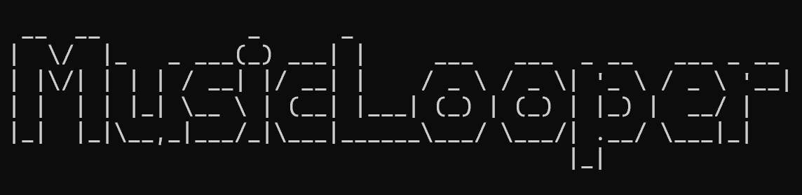
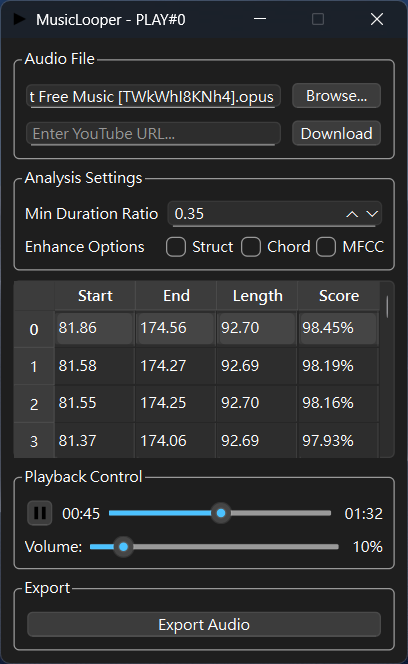

# MusicLooper

A Python-based program for automatically finding the best loop points to achieve seamless music looping. Provides an easy-to-use graphical user interface.

<p align="center"></p>

<table>
<tr>
<td width="60%">

### Features:

- Find loop points in any audio file (if they exist)
- Support for most common audio formats (MP3, OGG, FLAC, WAV)
- Seamless audio playback using automatically discovered loop points
- Intuitive graphical interface for previewing and selecting loop points
- Real-time loop preview
- Export loop points as metadata tags to audio files

</td>
<td width="40%">
<p align="center"></p>
</td>
</tr>
</table>

## Prerequisites

Music-Looper requires the following software to run:

- [Python (64-bit)](https://www.python.org/downloads/) = 3.12.x
- [Git](https://git-scm.com/downloads) (for downloading source code)
- [FFmpeg](https://ffmpeg.org/download.html) (for audio processing)

Supported audio formats include: WAV, FLAC, Ogg/Vorbis, Ogg/Opus, MP3.
Full list can be found at [libsndfile supported formats page](https://libsndfile.github.io/libsndfile/formats.html)

## Installation Steps

1. **Download Source Code**
   ```sh
   # Clone the repository using git
   git clone https://github.com/AllexaT/PyMusicLooperGUI.git
   
   # Enter project directory
   cd PyMusicLooperGUI
   ```

2. **Install `uv`**

   `uv` is the project's launcher used by `run.bat`. Follow the official installation guide:

   https://docs.astral.sh/uv/getting-started/installation/

   After installing, verify the installation with:

   ```sh
   uv --version
   ```

3. **FFmpeg Setup**
If FFmpeg is not installed:

- Download from the official site: https://ffmpeg.org/download.html

- Windows (recommended): install with `scoop`:

   ```powershell
   scoop install ffmpeg
   ```

   Or place the executables in `MusicLooper/ffmpeg/bin/`:

   ```
   MusicLooper/
   └── ffmpeg/
         └── bin/
               ├── ffmpeg.exe
               └── ffprobe.exe
   ```

## Running the Program

After installation, the project is now started primarily via the `uv` runner (the provided `run.bat` uses `uv`). The README shows the recommended method first and two fallback options.

- **Recommended (Windows — `run.bat`)**

   Run the included launcher which checks for `uv` and starts the app:

   ```powershell
   .\run.bat
   ```

   `run.bat` executes `uv run python src/__main__.py` when `uv` is available.

- **Manual with `uv`**

   If you have the `uv` CLI installed, start directly with:

   ```sh
   uv run python src/__main__.py
   ```

- **Fallback with Python**

   If you don't have `uv`, you can still run the program using Python directly from the project root:

   ```sh
   # Option 1: module-style
   python -m src

   # Option 2: run the script file
   python src/__main__.py
   ```

Make sure your virtual environment is activated if you installed dependencies into one.

## Usage Guide

### Main Features

1. **Load Audio Files**
   - Click "Browse..." button to select audio files
   - Or enter a YouTube URL.
   - Supported formats: MP3, WAV, FLAC, OGG

2. **Find Loop Points**
   - Program automatically analyzes and finds the best loop points after loading
   - Use sliders to manually adjust loop point positions
   - Real-time loop preview
   - Sort loop points by score or music length
   - Higher scores indicate more natural loop transitions

3. **Playback Controls**
   - Play/Pause: Use play button to control
   - Loop Mode: Always auto-loop
   - Volume Control: Adjust volume using slider
   - Progress Display: Shows current playback position and total duration

4. **Export Functions**
   - Save selected loop points as audio file metadata tags
   - Exported files retain original filename with added markers

### Advanced Options

- **Loop Length Limits**: 
  - Set minimum and maximum loop lengths
  - Default minimum length is 35% of total track duration
  - Adjusting these parameters helps find more suitable loop points

### Usage Tips

1. **Selecting Best Loop Points**:
   - Observe scores: Higher scores indicate more ideal loop points
   - Use preview function: Verify if loop transitions sound natural
   - Try different loop points to find the most suitable one

2. **Audio File Quality**:
   - Recommend using lossless formats (like WAV, FLAC) for best results
   - Higher quality audio files make it easier to find good loop points

## Troubleshooting

If you encounter issues:
1. Verify Python version is 3.12.x
2. Confirm all required packages are properly installed
3. Check if audio file format is supported
4. Ensure virtual environment is activated (if using)

## Acknowledgments

Thanks to [ARKROW](https://github.com/ARKROW) for their significant contribution to this project. This project is **based on** their excellent work, [Pymusiclooper](https://github.com/ARKROW/PyMusicLooper). Their foundational efforts laid important groundwork and their creativity and effort enabled this project to come to life and develop.

---
